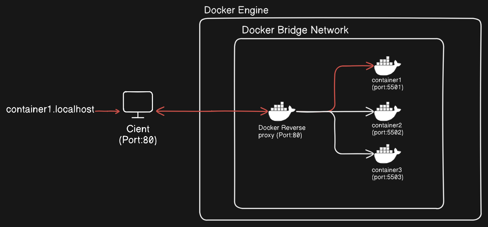

# Docker Reverse Proxy

This project implements a **reverse proxy** for Docker containers, allowing you to access your containers using URLs like `container-name.localhost`. It dynamically registers running containers and proxies requests based on subdomains. The reverse proxy runs on **port 80**, making it easy to access your Docker containers without specifying custom ports. 

Additionally, a **management API** is provided on port **8080** to simplify container creation and management. 

---

## Features  
- **Dynamic Reverse Proxy**: Automatically maps running Docker containers to `<container-name>.localhost`.  
- **Port 80 Exposure**: Exposes the proxy at port 80 for simple URL access.  
- **Management API**: Allows you to create and manage containers via an API.  
- **Auto-pull Docker Images**: Automatically pulls images if they don’t exist locally.  

## Architecture  

Below is a high-level architecture diagram illustrating the reverse proxy and management API setup:




---

## Prerequisites  

- **Docker** installed and running on your machine.  
- **Node.js** installed (v14 or higher recommended).  
- **Docker socket access** (`/var/run/docker.sock`).

---

## Setup  

1. **Clone the Repository**  
   ```bash
   git clone <repository-url>
   cd <repository-name>

2. **Install Dependencies**  
   ```bash
   npm install

3. **Run the Reverse Proxy and Management API**  
   ```bash
   sudo node index.js


---

## Usage  

### Accessing Docker Containers  

- Start any Docker container, and the proxy will automatically register it.
- Visit:  http://<container-name>.localhost

#### Management API  

The management API provides endpoints to manage Docker containers.  

#### 1. Create a Container  
**Endpoint:**  
POST /containers

**Request Body:**
{
  "image": "nginx",
  "tag": "latest"
}

**Response:**
{
  "status": "success",
  "container": "nginx.localhost"
}

## Code Overview  

1. **Reverse Proxy Logic**  
   - Uses `dockerode` to listen for Docker container events.
   - Automatically maps running containers to `<container-name>.localhost`.

2. **Proxying Requests**  
   - Extracts the subdomain from requests.
   - Forwards traffic to the appropriate Docker container's IP and port.

3. **Management API**  
   - Provides a simple API to create Docker containers.
   - Automatically pulls Docker images if they don’t exist locally.


## Troubleshooting  

1. **Permission Issues**  
   - Ensure that your user has access to `/var/run/docker.sock`. You may need to adjust permissions:
     sudo chmod 666 /var/run/docker.sock

2. **Port Conflicts**  
   - Make sure port **80** and **8080** are not in use by other services.  

3. **Containers not Registered**  
   - Ensure the containers expose ports using `EXPOSE` in their Dockerfiles.


## Contributing  

Feel free to fork the repository and submit pull requests for improvements or new features.  


## License  

This project is licensed under the **MIT License**. See [LICENSE](LICENSE) for more details.  


## Contact  

For issues or inquiries, please open an issue on the repository. 


### Example Output  

Management API is running on port 8080  
Reverse Proxy is running on port 80  
Registering nginx.localhost --> http://172.17.0.2:80  
Forwarding nginx.localhost -> http://172.17.0.2:80  


